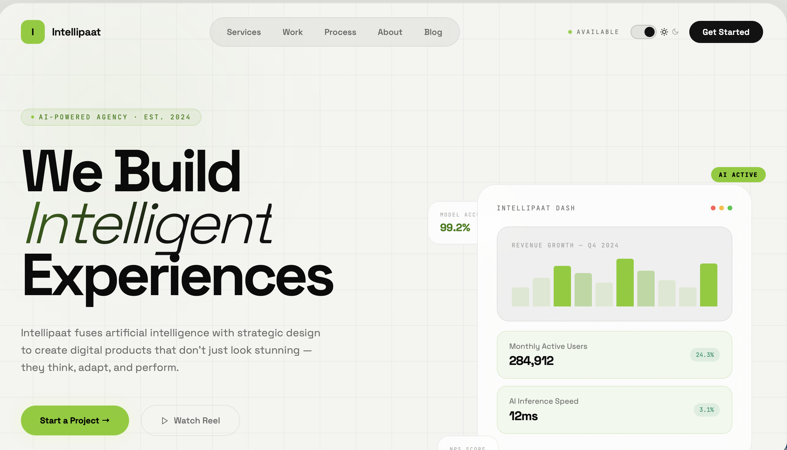

<div align="center">
  
</div>

<br/>

<div align="center">

# Intellipaat

### AI-Powered Agency Website — React · Sanity CMS · Dark/Light Mode

[](https://reactjs.org)
[](https://reactrouter.com)
[](https://sanity.io)
[](LICENSE)

[Live Demo](#) · [Sanity Studio](#) · [Setup Guide](SETUP.md)

</div>

---

## Overview

**Intellipaat** is a production-ready agency website built with a full modern stack. It features a distinctive **Obsidian & Lime** glassmorphism design system, complete Sanity CMS integration across every page, a working light/dark mode toggle, and real photo content throughout.

Every page ships with graceful **static fallbacks** — the site looks and works perfectly even before Sanity is connected. Once you add your Project ID, all content becomes live-editable from the Sanity Studio.

---

## Features

| Feature | Details |
|---|---|
| **Design System** | Obsidian & Lime glassmorphism — `#ccff00` lime accent, 16px backdrop blur, 60px grid, glow spheres |
| **6 Routed Pages** | Home, Services, Work, Process, About, Blog — all connected to Sanity |
| **Light / Dark Mode** | CSS variable-driven, persisted to `localStorage`, smooth 0.3s transitions |
| **Sanity CMS** | Every page, every component — GROQ queries with static fallbacks |
| **Custom Studio** | Structured sidebar, 9 schema types, singleton Site Settings |
| **Real Images** | Unsplash photos on Work, Blog, and About pages with hover zoom |
| **SVG Icons** | Custom inline SVGs — no emoji, no icon fonts |
| **Mobile Responsive** | Hamburger menu, responsive bento grids, adaptive hero |
| **Zero Warnings** | `Compiled successfully.` — clean production build |

---

## Pages

```
/              Home        → Hero, logos strip, bento feature grid
/services      Services    → 6 expandable service cards + pricing tiers
/work          Work        → Filterable portfolio grid + stats bar
/process       Process     → Accordion phases + client testimonials
/about         About       → Mission, values, team grid, numbers
/blog          Blog        → Featured post + grid + newsletter signup
```

---

## Tech Stack

```
Frontend          React 18 · React Router v6 · CSS Variables
CMS               Sanity v3 · GROQ · @sanity/client · @sanity/image-url
Styling           Custom CSS · Space Grotesk · JetBrains Mono
Tooling           Create React App · ESLint
Fonts             Google Fonts (Space Grotesk + JetBrains Mono)
Images            Sanity Asset Pipeline + Unsplash fallbacks
```

---

## Project Structure

```
intellipaat/
│
├── src/
│   ├── App.js                     # BrowserRouter + ThemeProvider + Routes
│   ├── index.css                  # Global styles, CSS variables (dark + light)
│   │
│   ├── context/
│   │   └── ThemeContext.js        # Light/dark mode context + localStorage
│   │
│   ├── hooks/
│   │   └── useSanity.js           # Generic GROQ data-fetching hook
│   │
│   ├── lib/
│   │   ├── sanityClient.js        # Sanity client + urlFor() image helper
│   │   └── queries.js             # All 7 GROQ queries (one per page/section)
│   │
│   ├── components/
│   │   ├── Navbar.js / .css       # Logo, nav pill, theme toggle, hamburger
│   │   ├── Footer.js              # CTA, social links — reads from Sanity
│   │   └── Loader.js / .css       # Animated bar loader + ErrorState component
│   │
│   └── pages/
│       ├── Home.js / .css         # Hero, logos, bento grid
│       ├── Services.js / .css     # Expandable service cards, pricing strip
│       ├── Work.js / .css         # Filterable project grid, stats
│       ├── Process.js / .css      # Accordion phases, testimonials
│       ├── About.js / .css        # Mission, values, team, numbers
│       └── Blog.js / .css         # Featured post, posts grid, newsletter
│
├── studio/
│   ├── sanity.config.js           # Studio configuration
│   ├── sanity.cli.js              # CLI configuration
│   ├── package.json               # Studio dependencies
│   │
│   ├── schemas/
│   │   ├── index.js               # Schema registry (all 9 types)
│   │   ├── siteSettings.js        # Global settings — hero, footer, social
│   │   ├── post.js                # Blog post (title, body, image, author)
│   │   ├── project.js             # Portfolio project (image, tags, metric)
│   │   ├── service.js             # Service card (icon, deliverables)
│   │   ├── teamMember.js          # Team member (photo, bio, LinkedIn)
│   │   └── misc.js                # processPhase, testimonial, companyValue,
│   │                              #   bentoCard, clientLogo
│   │
│   └── structure/
│       └── deskStructure.js       # Custom Studio sidebar (NO StructureBuilder import)
│
├── public/
│   └── preview.png                # Website preview image
│
├── .env.example                   # Environment variable template
├── SETUP.md                       # Full Sanity connection guide
└── README.md                      # This file
```

---

## Quick Start

### 1. Install & run the React app

```bash
# Clone or unzip the project
cd intellipaat

# Install dependencies
npm install

# Start development server
npm start
# Opens at http://localhost:3000
```

The site runs immediately with static fallback content — no Sanity setup required.

---

### 2. Connect Sanity CMS (optional — for live editing)

```bash
# Copy environment template
cp .env.example .env

# Edit .env — add your Sanity Project ID
# Get it from https://sanity.io/manage
REACT_APP_SANITY_PROJECT_ID=your_project_id_here
REACT_APP_SANITY_DATASET=production
```

Then restart the dev server. The yellow "Showing static content" banners will disappear once Sanity is connected and content is added.

> **Full walkthrough:** See [SETUP.md](SETUP.md) for step-by-step Sanity setup, CORS configuration, and content population guide.

---

### 3. Launch the Sanity Studio

```bash
cd studio

# Copy studio env template
cp .env.example .env
# Add SANITY_STUDIO_PROJECT_ID=your_project_id

npm install
npm run dev
# Studio opens at http://localhost:3333
```

**Studio sidebar structure:**

```
⚙️  Site Settings     → site name, hero text, footer CTA, social links
🏠  Home Page         → client logos, bento feature cards
🛠  Services          → service cards with icons and deliverables
💼  Work / Portfolio  → projects with images, tags, metrics
📋  Process           → phases and client testimonials
👥  About             → team members, company values
✍️  Blog              → posts with rich text, images, categories
```

---

### 4. Deploy the Studio for your team

```bash
cd studio
npm run deploy
# Deploys to https://intellipaat.sanity.studio
```

---

## Environment Variables

**React app** (`intellipaat/.env`):

```env
REACT_APP_SANITY_PROJECT_ID=your_project_id_here
REACT_APP_SANITY_DATASET=production
```

**Sanity Studio** (`intellipaat/studio/.env`):

```env
SANITY_STUDIO_PROJECT_ID=your_project_id_here
SANITY_STUDIO_DATASET=production
```

---

## Sanity Schema Types

| Schema | Type | Used On |
|---|---|---|
| `siteSettings` | Singleton | Navbar, Footer, Home hero |
| `post` | Collection | Blog page |
| `project` | Collection | Work / Portfolio page |
| `service` | Collection | Services page |
| `teamMember` | Collection | About page |
| `processPhase` | Collection | Process page |
| `testimonial` | Collection | Process page |
| `companyValue` | Collection | About page |
| `bentoCard` | Collection | Home page |
| `clientLogo` | Collection | Home logos strip |

---

## Design Tokens

```css
/* Core palette */
--lime:        #ccff00   /* Primary accent (dark mode) */
--lime:        #84cc16   /* Primary accent (light mode) */
--emerald:     #10b981   /* Secondary accent */
--shell-bg:    #0c0c0c   /* Dark shell background */
--shell-bg:    #f4f4f1   /* Light shell background */

/* Typography */
font-family: 'Space Grotesk'   /* Headings + body */
font-family: 'JetBrains Mono'  /* Labels + metadata + code */

/* Glassmorphism */
background:       rgba(255,255,255,0.03)
backdrop-filter:  blur(16px)
border:           1px solid rgba(255,255,255,0.1)
border-radius:    2rem – 2.5rem
```

---

## Build for Production

```bash
# React app
npm run build
# Output in /build — ready to deploy to Vercel, Netlify, etc.

# Deploy to Vercel (recommended)
npx vercel
# Add env vars in Vercel dashboard → Settings → Environment Variables
```

---

## Troubleshooting

| Problem | Solution |
|---|---|
| Studio shows `StructureBuilder` error | Open `studio/structure/deskStructure.js` — remove any `import` from the top. The `S` builder is injected automatically. |
| "Failed to load content" banners | Check CORS in Sanity dashboard → API → CORS Origins → add `http://localhost:3000` |
| Images not loading from Sanity | Ensure `useCdn: true` in `src/lib/sanityClient.js` for production |
| Stale content after publishing | Sanity CDN caches for ~60s — wait or set `useCdn: false` in development |
| `npm run build` fails | Run `CI=false npm run build` to bypass warning-as-error treatment |

---

## License

MIT — free to use, modify, and deploy for personal and commercial projects.

---

<div align="center">

Built with React, Sanity, and a lot of `#ccff00`

**[Back to top ↑](#intellipaat)**

</div>
# Intellipaat
